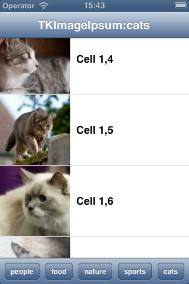

#TKImageIpsum

##About

TKImageIpsum is a small helper class which can download random images with given size from [http://lorempixel.com/](http://lorempixel.com/) or other similar service. Fetched images are cached in the memory with the `key` and `group` parametes as identifiers.

##How it works

It uses a `NSOperationQueue` that consumes `NSBlockOperation` blocks to check the `NSCache` and if cache is empty to download an image from the given formatURL using `[NSData dataWithContentsOfURL:]`. Caches can be cleaned in low memory situations.

##Usage
To get a random `UIImage` with size of `CGSize size` simply call:

		[TKImageIpsum getRandomImageWithSize:(CGSize)size withCompletionBlock:^(UIImage *image){
			// your code
		}];

and then use the returned UIImage instance from within the block how you want :D

You can also use 

			+ (void)getRandomImageWithSize:(CGSize)size
								     group:(id<NSCopying>)group
								       key:(id<NSCopying>)key
			          withCompletionBlock:(void (^)(UIImage *image))completionBlock;
			
with `group` and `key` parameter if you want to have few UITable/UICollectionViews filled with random images, see demo for a idea how to use it.

##Note

If you want to set image for UITableViewCell call `[cell setNeedsLayout]` in the block:

		- (UITableViewCell *)tableView:(UITableView *)tableView cellForRowAtIndexPath:(NSIndexPath *)indexPath{
		    static NSString *CellIdentifier = @"Cell";
		    
		    
		    TKTableViewCell *cell = (TKTableViewCell *)[tableView dequeueReusableCellWithIdentifier:CellIdentifier];
		    if (cell == nil) {
		        cell = [[TKTableViewCell alloc] initWithStyle:UITableViewCellStyleSubtitle 											   reuseIdentifier:CellIdentifier];
		    }
		    cell.textLabel.text = [NSString stringWithFormat:@"Cell %d", indexPath.row + 1];
		    
		    [TKImageIpsum getRandomImageWithSize:CGSizeMake(tableView.rowHeight, tableView.rowHeight)
		                                   group:self.title
		                                     key:indexPath
		                     withCompletionBlock:^(UIImage *image) {
		                         dispatch_async(dispatch_get_main_queue(), ^{
		                             if ([[tableView indexPathForCell:cell] isEqual:indexPath]) {
		                                 cell.imageView.image = image;
		                                 [cell setNeedsLayout];
		                             }
		                         });
		                     }];
		    
		    return cell;
		}
		
and remember to call  

		cell.imageView.image = nil

inside overriden `prepareForReuse` in your cell subclass of `UITableViewCell` or `UICollectionViewCell`

##Cocoapods
✔ Obviously 

##Demo project
✔ Attached

##ARC
✔ yup

##Contact

- [@mapedd](https://twitter.com/mapedd)
- [mapedd@mapedd.com](mapedd@gmail.com/ "Title")

##License
Apache